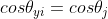
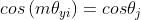
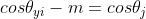
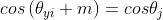
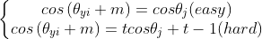
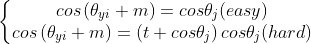
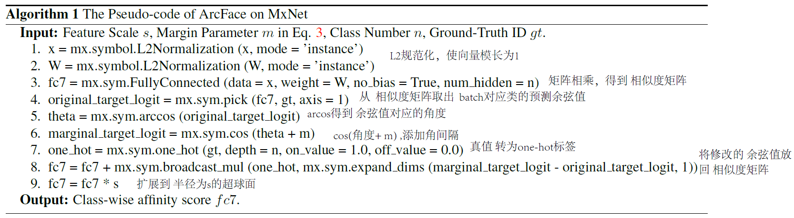

# FaceVerLoss
> 代码收录：[PytorchNetHub](https://github.com/bobo0810/PytorchNetHub)
>

## 说明
- 基于人脸识别的分类器
- 源码解读 + 代码复现

## 汇总
|模型|代码|备注|来源|更新|
|:---:|:----:|:---:|:------:|:------:|
|[AMSoftmax](https://arxiv.org/pdf/1801.05599.pdf)|[原地址](https://github.com/cavalleria/cavaface.pytorch)|乘法角间隔||2020.9|
|[ArcFace](https://arxiv.org/abs/1801.07698)|[原地址](https://github.com/cavalleria/cavaface.pytorch)|加法角间隔|CVPR2019|2020.9|
|[CircleLoss](https://arxiv.org/abs/2002.10857)|[原地址](https://github.com/xialuxi/CircleLoss_Face)|加权角间隔|CVPR2020|2020.9|
|[DiscFace](https://openaccess.thecvf.com/content/ACCV2020/html/Kim_DiscFace_Minimum_Discrepancy_Learning_for_Deep_Face_Recognition_ACCV_2020_paper.html)|复现|最小化差异学习|ACCV2020|2020.12|

决策边界

|Loss|Decision Boundary|
|:---:|:----:|
|Softmax||
|SphereFace||
|CosFace/AMSoftmax||
|ArcFace||
|MV-Arc-Softmax||
|CurricularFace||
## 论文解读

- [CenterLoss:A Discriminative Feature Learning Approach for Deep Face Recognition](#CenterLoss:A Discriminative Feature Learning Approach for Deep Face Recognition)
- [ArcFace: Additive Angular Margin Loss for Deep Face Recognition](#ArcFace: Additive Angular Margin Loss for Deep Face Recognition)
- [DiscFace: Minimum Discrepancy Learning for Deep Face Recognition](#DiscFace: Minimum Discrepancy Learning for Deep Face Recognition)

### CenterLoss:A Discriminative Feature Learning Approach for Deep Face Recognition

ECCV2016

| 主题   | 描述                                                         |
| ------ | :----------------------------------------------------------- |
| 问题   | Softmax只促进特征可分离性，对人脸识别（类内紧凑，类间区隔）并不有效。 |
| 创新点 | 针对人脸识别，为加强特征可区分能力，提出Center-Loss。        |
| 原理   | 1. 基于mini-batch更新类中心。 2. 为避免少量错误标记造成较大扰动，使用α控制学习率。 |
| 好处   | 1. 学习类中心，惩罚类间距离。 2. 易于训练、优化。        |

### ArcFace: Additive Angular Margin Loss for Deep Face Recognition

CVPR2019

| 主题 | 描述                  |
| ---- | :-------------------- |
| 原理 |  |

### DiscFace: Minimum Discrepancy Learning for Deep Face Recognition

ACCV2020  

| 主题   | 描述                                                         |
| ------ | :----------------------------------------------------------- |
| 问题   | 基于Softmax方法：训练过程中，类中心周围的样本特征虽然与类中心接近，但各自方向不同，彼此间隔较大 。这种方向性的差异将导致评估性能下降。 注：训练阶段优化样本特征与类中心距离，评估阶段衡量样本对之间角距离。 |
| 创新点 | 1. 第一个提出 “解决过程差异”问题。 2. 提出正则化方法“最小偏差学习”：通过一个可学习偏差 迫使类内样本特征朝向最优方向。 3. 可学习偏差  有助于从样本特征中分离出“类不变向量”。 |
| 原理   |                                        |
| 好处   | 1. 适用于 “类别不平衡” 及 “类别数量大，类内样本少”  的数据集。 2. 容易嵌入CosFace\ArcFace等基于Softmax的分类器中。 |

