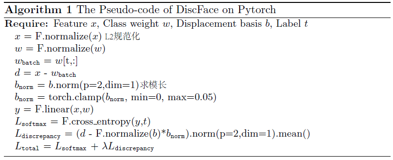

# FaceVerLoss
> 代码收录：[PytorchNetHub](https://github.com/bobo0810/PytorchNetHub)
>
> 论文解读：[PapersList](https://github.com/bobo0810/PapersList)

## 说明
- 基于标签分类的分类器
- 源码解读,便于理解

## 汇总
|模型|原仓库|备注|来源|更新|
|:---:|:----:|:---:|:------:|:------:|
|[AMSoftmax](https://arxiv.org/pdf/1801.05599.pdf)|[原地址](https://github.com/cavalleria/cavaface.pytorch)|乘法角间隔||2020.9|
|[ArcFace](https://arxiv.org/abs/1801.07698)|[原地址](https://github.com/cavalleria/cavaface.pytorch)|加法角间隔|CVPR2019|2020.9|
|[CircleLoss](https://arxiv.org/abs/2002.10857)|[原地址](https://github.com/xialuxi/CircleLoss_Face)|加权角间隔|CVPR2020|2020.9|
|[DiscFace](https://openaccess.thecvf.com/content/ACCV2020/html/Kim_DiscFace_Minimum_Discrepancy_Learning_for_Deep_Face_Recognition_ACCV_2020_paper.html)|复现|最小化差异学习|ACCV2020|2020.12|

## 决策边界
|Loss|Decision Boundary|
|:---:|:----:|
|Softmax||
|SphereFace||
|CosFace/AMSoftmax||
|ArcFace||
|MV-Arc-Softmax||
|CurricularFace||
___

## ArcFace

Paper伪代码

## DiscFace

Paper伪代码
